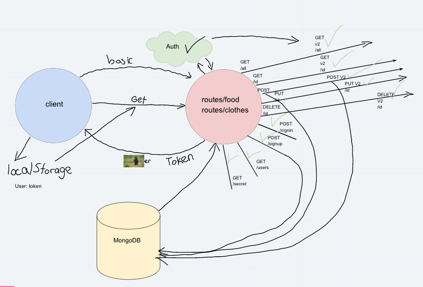

# LAB: Access Control

Authentication Server Phase 3: Deploy an Express server that implements basic and bearer Authentication, with signup and signin capabilities, using a Mongo database. Any user that has successfully logged in using basic authentication (username and password) is able to continuously authenticate using a token. Implement Role Based Access Control (RBAC) using an Access Control List (ACL), allowing to not only restrict access to routes for valid users, but also based on the individual permissions we give each user.

## Author: Carly Dekock

## [Link to GitHub repository](https://github.com/carlydekock/auth-api.git)
## [Link to PR](https://github.com/carlydekock/auth-api/pull/2)

## Deployed links

- [Link to Heroku](https://cdekock-auth-api.herokuapp.com/)
- [Link to GitHub actions](https://github.com/carlydekock/bearer-auth/actions)

## The Setup

### How to install

- Clone down repository from GitHub
- Run the command ```npm install``` to install dependencies (@code-fellows/supergoose, base-64, bcrypt, cors, dotenv, eslint, express, jest, jsonwebtoken, method-override, mongoose, morgan, supertest)
- create .env file with PORT variable, MONGODB_URI, and SECRET

### How to test

- Run the command ```npm test``` to test and verify the server is working

### How to run

- Start the server using ```nodemon```
- Visit http://localhost:PORT at the PORT number you've assigned in your .env

## UML


## Credits and Collaborations

- Worked at lab table with Jason Q, Jason D, Nick M, Seid
- Help from Jacob for getting v2 routes functioning
